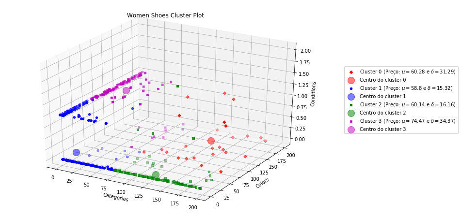

# Desafio-B2W---Women-Shoes
Desafio proposto pela B2W, no qual deve ser feito uma clusteriazação dos dados.
Resolvido pela aplicação de K-Means
Localizado em https://github.com/B2W-BIT/We-are-Hiring/tree/master/desafios-ia-front/clusters-sapatos


```python
import pandas as pd
import numpy as np
import matplotlib.pyplot as plt
from mpl_toolkits.mplot3d import Axes3D
from sklearn import preprocessing
from sklearn.cluster import KMeans
```


```python
file_url = "https://raw.githubusercontent.com/B2W-BIT/We-are-Hiring/master/desafios-ia-front/clusters-sapatos/shoes.json"
data = pd.read_json(file_url, orient="records", lines=True)
```

# Primeira etapa - Análise dos dados


```python
data.head(5)
```


<div>
<table border="1" class="dataframe">
  <thead>
    <tr style="text-align: right;">
      <th></th>
      <th>brand</th>
      <th>categories</th>
      <th>colors</th>
      <th>condition</th>
      <th>id</th>
      <th>isSale</th>
      <th>price</th>
    </tr>
  </thead>
  <tbody>
    <tr>
      <th>0</th>
      <td>Naturalizer</td>
      <td>[Clothing, Heels, All Women's Shoes, Shoes, Sa...</td>
      <td>[Silver, Cream]</td>
      <td>USED</td>
      <td>AVpfEf_hLJeJML431ueH</td>
      <td>False</td>
      <td>55.990</td>
    </tr>
    <tr>
      <th>1</th>
      <td>MUK LUKS</td>
      <td>[Clothing, All Women's Shoes, Women's Casual S...</td>
      <td>[Grey]</td>
      <td>NEW</td>
      <td>AVpi74XfLJeJML43qZAc</td>
      <td>True</td>
      <td>41.125</td>
    </tr>
    <tr>
      <th>2</th>
      <td>MUK LUKS</td>
      <td>[Clothing, All Women's Shoes, Women's Casual S...</td>
      <td>[Grey]</td>
      <td>NEW</td>
      <td>AVpi74XfLJeJML43qZAc</td>
      <td>False</td>
      <td>35.250</td>
    </tr>
    <tr>
      <th>3</th>
      <td>MUK LUKS</td>
      <td>[Clothing, All Women's Shoes, Shoes, Women's S...</td>
      <td>[Black]</td>
      <td>NEW</td>
      <td>AVpjXyCc1cnluZ0-V-Gj</td>
      <td>False</td>
      <td>24.750</td>
    </tr>
    <tr>
      <th>4</th>
      <td>MUK LUKS</td>
      <td>[Clothing, All Women's Shoes, Shoes, Women's S...</td>
      <td>[Grey]</td>
      <td>NEW</td>
      <td>AVphGKLPilAPnD_x1Nrm</td>
      <td>True</td>
      <td>31.695</td>
    </tr>
  </tbody>
</table>
</div>


```python
data.info()
```

    <class 'pandas.core.frame.DataFrame'>
    RangeIndex: 10000 entries, 0 to 9999
    Data columns (total 7 columns):
    brand         10000 non-null object
    categories    10000 non-null object
    colors        10000 non-null object
    condition     10000 non-null object
    id            10000 non-null object
    isSale        10000 non-null bool
    price         10000 non-null float64
    dtypes: bool(1), float64(1), object(5)
    memory usage: 478.6+ KB
    


```python
data = data.dropna()
#get list of unique id's
product_id = data['id'].value_counts().keys().tolist()
product_counts = data['id'].value_counts().tolist()
```


```python
#get list of colors and amount times it appears
colors_names = data['colors'].value_counts().keys().tolist()
colors_counts = data['colors'].value_counts().tolist()
```


```python
#get list of unique colors
colors_list = []

for colors in colors_names:
    for color_name in colors:
        if color_name not in colors_list:
            colors_list.append(color_name)
```


```python
#get list of categories and amount times it appears
categories_names = data['categories'].value_counts().keys().tolist()
categories_counts = data['categories'].value_counts().tolist()
```


```python
#get list of unique categories
categories_list = []

for categories in categories_names:
    for category_name in categories:
        if category_name not in categories_list:
            categories_list.append(category_name)
```

Repetindo a análise para as condições:


```python
#get list of conditions and amount times it appears
condition_names = data['condition'].value_counts().keys().tolist()
condition_counts = data['condition'].value_counts().tolist()
condition_list = condition_names
```

As condições são bem mais simples e só possuem duas alternativas, novo ou usado. 

# Segunda Etapa - Condicionamento das entradas

Agora precisamos criar apenas uma entrada para cada id, combinando as cores, condições e categorias. Como muitos dados possuem cores repetidas e categorias repetidas. Primeiro esses dados serão filtrados para que depois sejam codificados.


```python
product_color_list = []
all_color_list = []
for product in product_id:
    product_color = []
    for colors in data[data['id'] == str(product)]['colors']:
        for name in colors:
            all_color_list.append([name])
            if name not in product_color:
                product_color.append(name)
    product_color_list.append(product_color)
```


```python
product_category_list = []
all_category_list = []
for product in product_id:
    product_category = []
    for categories in data[data['id'] == str(product)]['categories']:
        for name in categories:
            all_category_list.append([name])
            if name not in product_category:
                product_category.append(name)
    product_category_list.append(product_category)

all_category_listDF = pd.DataFrame(data=all_category_list ,columns=['categories'])
categories_names_separeted = all_category_listDF['categories'].value_counts().keys().tolist()
categories_counts_separated = all_category_listDF['categories'].value_counts().tolist()
```


```python
all_category_listDF = pd.DataFrame(data=all_category_list ,columns=['categories'])
categories_names_separeted = all_category_listDF['categories'].value_counts().keys().tolist()
categories_counts_separated = all_category_listDF['categories'].value_counts().tolist()
    
categoriesOrdered = categories_names_separeted[-1::-2]+categories_names_separeted[1::2]
```


```python
product_condition_list = []
for product in product_id:
    product_condition = []
    for condition in data[data['id'] == str(product)]['condition']:
        if condition not in product_condition:
            product_condition.append(condition)
    product_condition_list.append(product_condition)
```


```python
cluster_data = pd.DataFrame(data=list(zip(product_id,product_color_list,product_category_list,product_condition_list)) , columns=['id','colors','categories','conditions'])
cluster_data.head(5)
```


<div>
<table border="1" class="dataframe">
  <thead>
    <tr style="text-align: right;">
      <th></th>
      <th>id</th>
      <th>colors</th>
      <th>categories</th>
      <th>conditions</th>
    </tr>
  </thead>
  <tbody>
    <tr>
      <th>0</th>
      <td>AV46uYe4glJLPUi8VW57</td>
      <td>[Pure, Blackchrome-Aurora]</td>
      <td>[Clothing, Women's Athletic Shoes, Womens, Wom...</td>
      <td>[USED]</td>
    </tr>
    <tr>
      <th>1</th>
      <td>AV2cZ7SYGV-KLJ3al3p6</td>
      <td>[Stone, Dark, Black, Luxe, Silver]</td>
      <td>[Heels, Pumps, Clothing, LifeStride, All Women...</td>
      <td>[USED]</td>
    </tr>
    <tr>
      <th>2</th>
      <td>AVpfn5s3LJeJML43ArJE</td>
      <td>[White]</td>
      <td>[Clothing, Womens, All Women's Shoes, Women's ...</td>
      <td>[USED]</td>
    </tr>
    <tr>
      <th>3</th>
      <td>AV-nbnIEKZqtpbFMSzYa</td>
      <td>[NA]</td>
      <td>[Heels, Pumps, Shoes, Simply Vera Vera Wang, W...</td>
      <td>[USED]</td>
    </tr>
    <tr>
      <th>4</th>
      <td>AVpidVDz1cnluZ0-Nd4_</td>
      <td>[Brown]</td>
      <td>[Clothing, All Women's Shoes, Women's Shoes, S...</td>
      <td>[USED]</td>
    </tr>
  </tbody>
</table>
</div>


Agora que os dados estão prontos, será feita a codificação.


```python
def create_col_labels(df,col_name):
    col = df[col_name].copy()
    col.update(col[(col.str.len() > 1)].apply(tuple))
    col.update(col[~(col.str.len() > 1)].apply(', '.join))
    
    cat_col = pd.Categorical(col, ordered=True, categories=col.value_counts().keys().tolist())
    labels, uniques = pd.factorize(cat_col,sort=True)
    df[col_name+'_labels'] = labels
    
create_col_labels(cluster_data,'categories')
create_col_labels(cluster_data,'colors')
create_col_labels(cluster_data,'conditions')
```


```python
cluster_data.head(5)
```


<div>
<table border="1" class="dataframe">
  <thead>
    <tr style="text-align: right;">
      <th></th>
      <th>id</th>
      <th>colors</th>
      <th>categories</th>
      <th>conditions</th>
      <th>categories_labels</th>
      <th>colors_labels</th>
      <th>conditions_labels</th>
    </tr>
  </thead>
  <tbody>
    <tr>
      <th>0</th>
      <td>AV46uYe4glJLPUi8VW57</td>
      <td>[Pure, Blackchrome-Aurora]</td>
      <td>[Clothing, Women's Athletic Shoes, Womens, Wom...</td>
      <td>[USED]</td>
      <td>108</td>
      <td>39</td>
      <td>0</td>
    </tr>
    <tr>
      <th>1</th>
      <td>AV2cZ7SYGV-KLJ3al3p6</td>
      <td>[Stone, Dark, Black, Luxe, Silver]</td>
      <td>[Heels, Pumps, Clothing, LifeStride, All Women...</td>
      <td>[USED]</td>
      <td>189</td>
      <td>189</td>
      <td>0</td>
    </tr>
    <tr>
      <th>2</th>
      <td>AVpfn5s3LJeJML43ArJE</td>
      <td>[White]</td>
      <td>[Clothing, Womens, All Women's Shoes, Women's ...</td>
      <td>[USED]</td>
      <td>162</td>
      <td>4</td>
      <td>0</td>
    </tr>
    <tr>
      <th>3</th>
      <td>AV-nbnIEKZqtpbFMSzYa</td>
      <td>[NA]</td>
      <td>[Heels, Pumps, Shoes, Simply Vera Vera Wang, W...</td>
      <td>[USED]</td>
      <td>83</td>
      <td>0</td>
      <td>0</td>
    </tr>
    <tr>
      <th>4</th>
      <td>AVpidVDz1cnluZ0-Nd4_</td>
      <td>[Brown]</td>
      <td>[Clothing, All Women's Shoes, Women's Shoes, S...</td>
      <td>[USED]</td>
      <td>150</td>
      <td>3</td>
      <td>0</td>
    </tr>
  </tbody>
</table>
</div>


# Terceira Etapa - Clusterização

Por fim, iremos tentar agrupar os nossos dados a fim de encontrar 4 clusters de acordo com as semelhanças que forem encontradas.


```python
num_clusters=4
kmeans = KMeans(n_clusters=num_clusters, random_state=0).fit(cluster_data[['categories_labels','colors_labels','conditions_labels']])
cluster_data['KMeans_labels'] = kmeans.labels_
cluster_centers = kmeans.cluster_centers_
for n_cluster in range(num_clusters):
    print('Para o Cluster {}:'.format(n_cluster))
    print('Centro em x: {:.3f}, y: {:.3f}, z: {:.3f}'.format(cluster_centers[n_cluster,0],cluster_centers[n_cluster,1],cluster_centers[n_cluster,2]))
    print('Média dos preços é de {:.2f}, com o desvio padrão de {:.2f}\n'.format(
        data[data['id'].isin(cluster_data[cluster_data['KMeans_labels']==n_cluster]['id'])]['price'].agg('mean'),
          data[data['id'].isin(cluster_data[cluster_data['KMeans_labels']==n_cluster]['id'])]['price'].agg('std')))
```

    Para o Cluster 0:
    Centro em x: 145.000, y: 122.462, z: 0.231
    Média dos preços é de 60.28, com o desvio padrão de 31.29
    
    Para o Cluster 1:
    Centro em x: 18.074, y: 4.811, z: 0.200
    Média dos preços é de 58.80, com o desvio padrão de 15.32
    
    Para o Cluster 2:
    Centro em x: 131.366, y: 6.149, z: 0.050
    Média dos preços é de 60.14, com o desvio padrão de 16.16
    
    Para o Cluster 3:
    Centro em x: 12.224, y: 137.935, z: 0.916
    Média dos preços é de 74.47, com o desvio padrão de 34.37
    
    


```python
#make 3d plot with cluster data
fig = plt.figure(figsize=(12,8))
ax = fig.add_subplot(111,projection='3d')

plot_color  = ['r','b','g','m']
plot_marker = ['D','o','s','X']

for c,m,cluster_label in zip(plot_color,plot_marker,range(num_clusters)):
    xs = cluster_data[cluster_data['id'].isin(cluster_data[cluster_data['KMeans_labels']==cluster_label]['id'])]['categories_labels']
    ys = cluster_data[cluster_data['id'].isin(cluster_data[cluster_data['KMeans_labels']==cluster_label]['id'])]['colors_labels']
    zs = cluster_data[cluster_data['id'].isin(cluster_data[cluster_data['KMeans_labels']==cluster_label]['id'])]['conditions_labels']
    mean_price = data[data['id'].isin(cluster_data[cluster_data['KMeans_labels']==cluster_label]['id'])]['price'].agg('mean')
    std_price = data[data['id'].isin(cluster_data[cluster_data['KMeans_labels']==cluster_label]['id'])]['price'].agg('std')
    ax.scatter(xs, ys, zs, c=c, marker=m, label='Cluster '+str(cluster_label)+' (Preço: $\mu = $'+str(round(mean_price,2))+' e $\delta = $'+str(round(std_price,2))+')')
    ax.scatter(cluster_centers[cluster_label, 0], cluster_centers[cluster_label, 1],cluster_centers[cluster_label,2],  
               c=c, s=200, alpha=0.5, label='Centro do cluster '+str(cluster_label));

ax.set_title('Women Shoes Cluster Plot')
ax.set_xlabel('Categories')
ax.set_ylabel('Colors')
ax.set_zlabel('Conditions')
ax.legend(bbox_to_anchor=(1.05, .7), loc='upper left', borderaxespad=0.)

plt.show()
```




